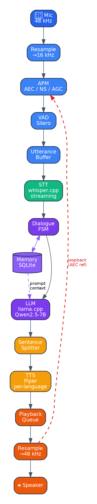
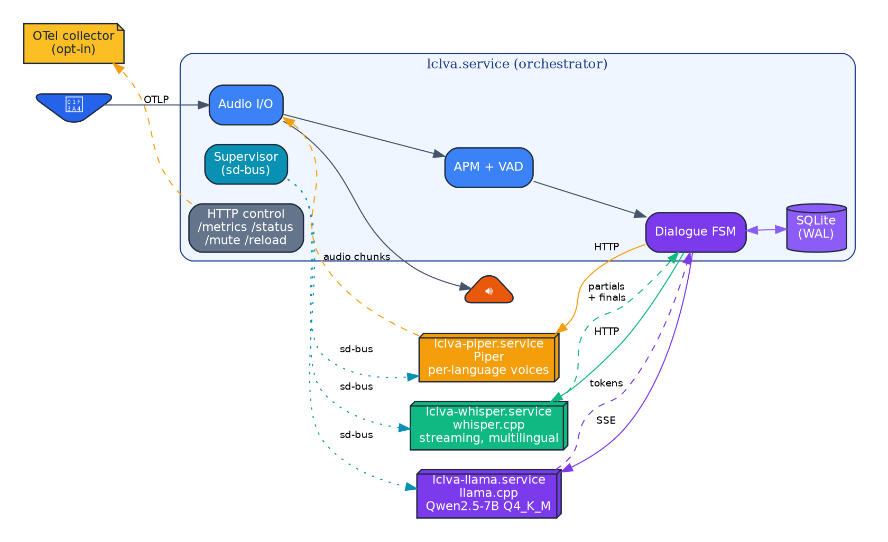
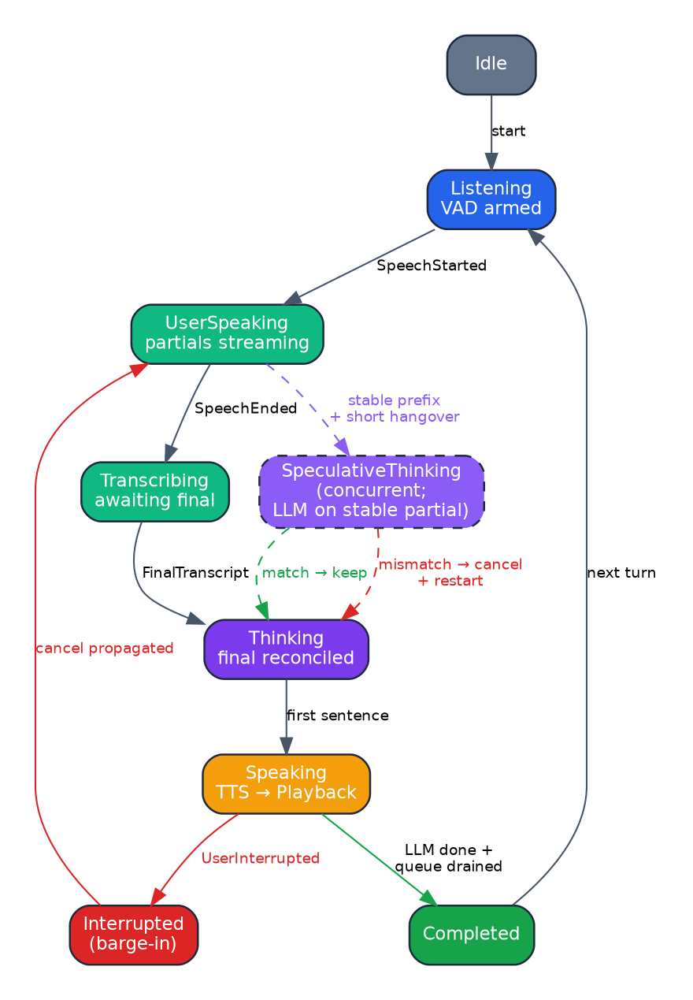
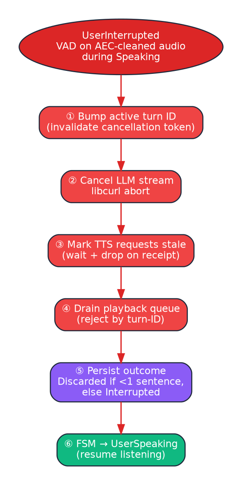
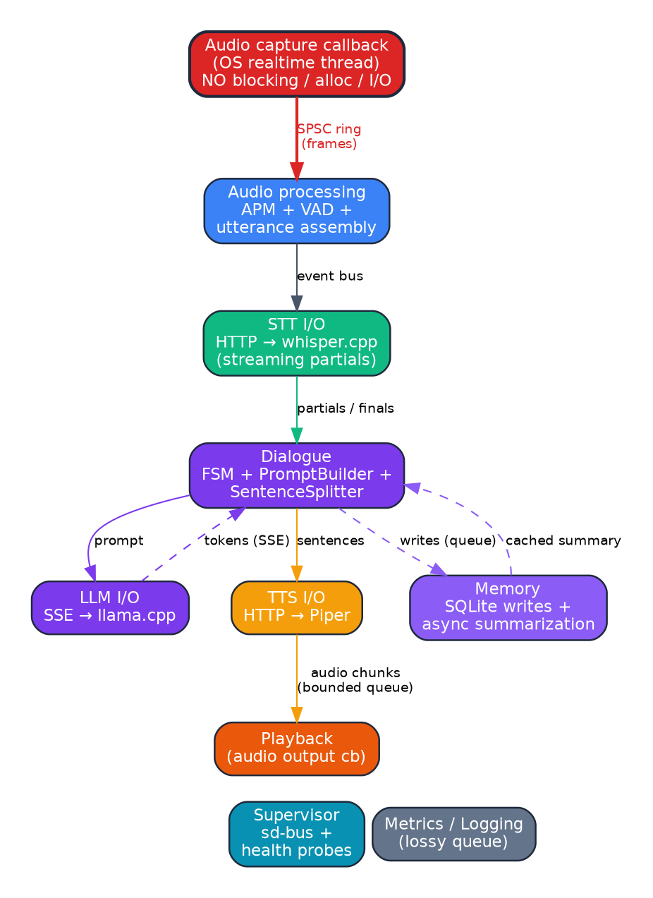

# Local Voice AI Orchestrator — Consolidated Project Design & Plan

Synthesis of:
- `local_voice_ai_orchestrator_mvp_cpp_architecture_2026.md` (original design)
- `architecture_review.md` (first review)
- Second-pass analysis (this document's author)

Open questions are tracked separately in `plans/open_questions.md`.

---

## 1. Project Goal

A local, production-grade, configurable voice assistant for long (30 min – multi-hour) conversations on a single workstation with an RTX 4060 (8 GB VRAM). The system must support reliable barge-in, bounded latency, crash recovery, and observability from day one.

Hardware target:
- GPU: RTX 4060 8 GB (exclusive use; no graceful degradation under contention)
- CPU: modern x86_64 (≥ 8 cores assumed)
- OS: Linux (Manjaro/Arch family primary; Ubuntu LTS secondary)
- Audio: speakers (primary UX) or headphones; mic via USB or built-in

Deployment: single-machine, all services on `127.0.0.1`, no auth/TLS on local IPC.

Non-goals for MVP: multi-user, mobile, custom model training, full-duplex perfection, emotional prosody, GPU-contention graceful degradation.

---

## 2. Architectural Pillars

These are the load-bearing decisions. Everything else is consequence.

1. **Process isolation for model runtimes.** llama.cpp, whisper.cpp, Piper run as separate processes. The C++ orchestrator owns control plane, audio I/O, state, memory, observability. Embedding is deferred until the control plane is mature.
2. **Cancellation is structural, not bolted on.** Every long-running operation (LLM stream, TTS request, playback queue) carries a cancellation token bound to a turn ID. Barge-in cancels by turn ID across all subsystems.
3. **Backpressure is mandatory.** Every async boundary uses bounded queues with explicit overflow policy. No unbounded growth permitted anywhere on the critical path.
4. **Realtime audio path is special.** Audio callback never blocks, never allocates, never does I/O. SPSC ring buffer is the only mechanism crossing the audio thread boundary.
5. **Observability before features.** Structured logs, per-turn trace IDs, and metrics exist from Milestone 0. Every component emits events. No untraced control-plane action.
6. **Configuration is data, not code.** YAML schema + validation at startup; hot reload only for safe fields.
7. **Crash recovery is a first-class state machine, not error handling.** SQLite has explicit turn lifecycle (`in_progress`, `committed`, `interrupted`, `discarded`); orchestrator runs a recovery sweep on startup.

---

## 3. Pipeline

> Diagrams in this document use Graphviz/DOT. Rendered by Obsidian, VSCode (with Graphviz extension), mkdocs-material with the `pymdownx.superfences` Graphviz custom_fence, or `dot -Tpng`. GitHub will display the source.

### 3.1 Data flow



The loopback path from final speaker output back into APM as the reference signal is the single most overlooked component in voice agent designs. It must be present before barge-in can work in speaker (non-headphone) mode.

### 3.2 Service topology



---

## 4. Component Responsibilities

### 4.1 Audio I/O

- Backend: **PortAudio**.
- Single `AudioDevice` abstraction; capture and playback share a `MonotonicAudioClock`.
- Hardware sample rate **48 kHz**; internal pipeline **16 kHz mono**. Single resample at capture entry.
- Device selection: OS default by default; config can override by name or index.
- Sample-rate conversion at well-defined points (see §5).
- Audio callback runs on the OS-provided realtime thread; pushes to lock-free SPSC ring; never allocates.
- Underrun/overrun counters exported as metrics.

### 4.2 Audio Processing Module (APM)

- WebRTC APM for AEC, NS, AGC.
- Operates on 10 ms frames at 16 kHz mono (AEC standard).
- Receives **mic frame + reference frame (post-mix loopback)** in lockstep, time-aligned within the AEC tolerance window (~10 ms).
- Reference signal source is the *final* mixed speaker output, not the raw Piper output. This requires a loopback tap after the playback resampler.
- AEC delay estimation runs continuously; logs delay in metrics.

### 4.3 VAD

- Silero VAD primary, on cleaned (post-APM) audio.
- Optional WebRTC VAD as fast pre-gate to skip Silero on obvious silence.
- Endpointing logic:
  - Speech onset: probability > `onset_threshold` for `min_speech_ms`.
  - Speech end: probability < `offset_threshold` for `hangover_ms` (default 600 ms).
  - Minimum utterance length: 200 ms (drop shorter as noise).
- Emits `SpeechStarted`, `SpeechEnded` events on the event bus.

### 4.4 Utterance Buffer

- Owns the audio captured between `SpeechStarted` and `SpeechEnded` plus configurable pre/post padding (default 300 ms each side).
- Reference-counted `AudioSlice`: a single buffer is allocated per utterance; consumers (STT, optional disk recorder) hold shared_ptr handles.
- Slice is released when the last consumer is done.
- Bounded total in-flight capacity; oldest utterance dropped (with metric) on overflow.

### 4.5 STT Service

- whisper.cpp running as a separate process. **CPU execution** (saves ~1 GB VRAM for Qwen).
- Multilingual model. Default size **small** (configurable: base / small / medium).
- **Streaming partial transcription** is in-MVP, not deferred. Sliding-window inference produces `PartialTranscript` events; on `SpeechEnded`, a `FinalTranscript` event closes the utterance.
- Each partial includes: text, language, confidence, "stable prefix length" (number of leading characters unlikely to be revised), and a sequence number per utterance.
- Input: 16 kHz mono PCM stream tagged with utterance ID; the service consumes audio incrementally as VAD emits frames.
- Output stream:
  - `PartialTranscript {utterance_id, sequence, text, stable_prefix_len, lang, confidence}`
  - `FinalTranscript   {utterance_id, text, lang, confidence, audio_duration_ms, processing_ms}`
- Health: HTTP `/health`; supervisor pings every 5 s when idle.

### 4.6 LLM Service

- llama.cpp server with OpenAI-compatible API.
- Model: Qwen2.5-7B-Instruct, **Q4_K_M** (~4.5 GB VRAM).
- Streaming via SSE.
- Multilingual: Qwen2.5 handles many languages; system prompt instructs the model to reply in the detected user-turn language (passed in as context).
- Keep-alive: orchestrator sends a 1-token completion every `keep_alive_interval_sec` (default 60 s) when idle to prevent model offload.
- HTTP client split:
  - `cpp-httplib` for health checks, simple completions, model warmup.
  - `libcurl` for SSE streaming (reliable, well-debugged, supports cancellation).

### 4.7 Dialogue Manager

Owns conversational state. Pure logic component; no audio, no I/O, no inference.

Responsibilities:
- Drive the Dialogue FSM (§6).
- Consume `PartialTranscript` and `FinalTranscript` events. Apply **speculation policy**: if a partial's stable prefix is "long enough and stable" (see §6) and VAD has been near-silent for `speculation_hangover_ms`, optimistically start LLM generation against the speculative transcript. If the final transcript diverges from the speculation, cancel the speculative LLM run and restart against the final.
- Build LLM prompt from memory + recent turns (delegates to `PromptBuilder`). Pass detected language to PromptBuilder so the system prompt instructs the model to reply in that language.
- Receive LLM token stream; pass to `SentenceSplitter`.
- Forward sentences to TTS with sequence numbers tied to the active turn ID, **and the detected language** (selects Piper voice).
- Decide turn outcome on interruption.
- Decide what gets persisted to memory (turn text, language, speculative-vs-final marker if relevant).
- Apply backpressure limits (max sentences, max queued TTS).
- (Tool calling is **out of scope for MVP** — no architectural reservation; revisit post-MVP.)

### 4.8 SentenceSplitter

Explicit, unit-tested component. Not "split on `.!?`".

- Streaming token-in, sentence-out.
- Handles abbreviations (`Dr.`, `e.g.`, `i.e.`, `etc.`), decimals (`3.14`), enumerations (`1.`, `2.`), code fences, ellipses.
- Emits a sentence only when:
  - Terminal punctuation seen, AND
  - Followed by whitespace + capital, OR end-of-stream, OR tokens-since-punctuation exceeds threshold (forces flush of long unterminated text).
- Configurable max-sentence length to force early flush (prevents TTS starvation on a very long sentence).

### 4.9 TTS Service

- Piper as a separate process. CPU-resident (frees VRAM).
- **Per-language voice pack.** Config maps language → voice model path. Voices are **lazy-loaded** on first use and kept resident (LRU eviction if total voice memory exceeds budget; default budget 500 MB).
- Sentence-level synthesis. Each request carries `(turn_id, sequence_number, language, text)`.
- Output: 22.05 kHz audio chunks tagged with turn_id and sequence_number.
- Voice pack config example:
  ```yaml
  tts:
    voices:
      en: /opt/piper/voices/en_US-amy-medium.onnx
      ru: /opt/piper/voices/ru_RU-irina-medium.onnx
      de: /opt/piper/voices/de_DE-thorsten-medium.onnx
    voice_memory_budget_mb: 500
  ```

### 4.10 Playback Queue

- Bounded queue of audio chunks tagged `(turn_id, sequence_number)`.
- Drop-policy on cancellation: when current turn ID is invalidated, drain queue immediately and emit a "playback interrupted" event.
- Stale chunks (chunks whose turn_id no longer matches the active turn) are rejected at enqueue and dequeue. This handles races between TTS completion and barge-in cancellation.

### 4.11 Memory Subsystem

- SQLite, WAL mode, `synchronous=NORMAL`.
- All writes happen on a dedicated memory thread; Dialogue Manager submits writes via a queue.
- Schema (see §9).
- Summarization is fully async: a background task computes summaries and updates a cached `current_summary` row; prompt assembly reads the cached version, never blocks waiting for fresh summary.

### 4.12 Supervisor

The supervisor manages **systemd units** for external services (llama.cpp, whisper.cpp, Piper). It does **not** fork child processes. It treats systemd as the process manager and itself as a controller/observer.

- Per-service logical state machine: `NotConfigured → Starting → Healthy → Degraded → Unhealthy → Restarting → Disabled`.
- Unit interaction via `systemctl` (subprocess) or sd-bus (preferred, see open questions).
- On unhealthy: `systemctl restart lclva-llama.service` (or equivalent), with the orchestrator's own backoff layered on top of systemd's restart policy.
- Health probes (HTTP `/health`, completion probes) run from the orchestrator regardless of systemd status — systemd knows the process is up, only the orchestrator can know whether the model is actually serving.
- Pipeline-level fail conditions (see §10).
- Keep-alive policy for LLM.

Distribution ships systemd unit files (`lclva-llama.service`, `lclva-whisper.service`, `lclva-piper.service`, plus `lclva.service` for the orchestrator itself) under `/usr/lib/systemd/system/` or `~/.config/systemd/user/`. Per-user (`systemd --user`) is the default deployment mode; system-wide is supported for shared workstations.

Logs from external services flow into journald automatically; the orchestrator's structured JSON logs also go to journald via `StandardOutput=journal`.

### 4.13 Event Bus

Two distinct mechanisms:

1. **Audio data path**: lock-free SPSC ring buffer between audio callback and audio processing thread. Fixed-size frames. No allocations in callback.
2. **Control event bus**: typed pub/sub for everything else. Bounded queues per subscriber with per-queue overflow policy. Built on a small in-process event dispatcher; not a generic message bus library.

### 4.14 Observability

- **Logs**: structured JSON to stdout (captured by journald via systemd unit). One event per line. Per-turn trace IDs propagated through every event.
- **Metrics**: Prometheus exposition format on `/metrics` (HTTP, localhost only) via `prometheus-cpp`.
- **Traces**: real **OTLP traces** via `opentelemetry-cpp`. Each user turn is a span tree with stages as child spans (`audio_segment, vad_end, stt_start, stt_final, llm_start, first_token, first_sentence, tts_start, first_audio, playback_start, playback_end, turn_committed`). OTLP HTTP export to a configurable endpoint (default disabled; opt-in via `observability.otlp.endpoint`).
- A local OTel collector (e.g., otelcol-contrib) is the recommended target; users without one can leave OTLP disabled and rely on JSON logs + offline trace reconstruction.

---

## 5. Audio Clock & Resampling Strategy

This was missing from both the original doc and the review.

- **Master clock**: capture device. Playback resamples to capture rate to keep AEC reference aligned.
- **Sample rate conversions**:
  - Mic native (likely 44.1 or 48 kHz) → 16 kHz mono for APM/VAD/STT pipeline. One resample at capture entry.
  - Piper output (22.05 kHz) → playback device rate at playback resampler. Loopback tap is taken **after** this resample (so AEC sees what the speaker actually emits).
- **MonotonicAudioClock**: a single clock object tied to capture frame counter, used to timestamp every audio frame and AEC reference frame. Drift between capture and playback hardware is corrected via the playback resampler ratio adjustment (slow drift) rather than buffer drops.
- Resampling library: **soxr**, used everywhere. Higher quality than libsamplerate; phase-stable enough that AEC alignment is robust. Single library = single failure mode.

---

## 6. Dialogue State Machine

With streaming partial STT, the FSM allows `Transcribing` and `Thinking` to **overlap**: the LLM may speculatively start on a stable partial while STT is still finalizing.



### Speculation policy

A speculative LLM run is started when **all** of:
- VAD has been below `offset_threshold` for `speculation_hangover_ms` (default 250 ms — shorter than the full endpoint hangover of 600 ms).
- The latest partial's `stable_prefix_len` covers ≥ `speculation_min_chars` (default 20) of text.
- The stable prefix has not changed for `speculation_stability_ms` (default 200 ms).

When `FinalTranscript` arrives:
- If final's prefix matches the speculation's prefix within `speculation_match_ratio` (default 0.9), keep the speculative LLM run; just feed any tail tokens via prompt patch if necessary.
- Otherwise, **cancel** the speculative LLM run (turn ID bump) and start fresh against the final. This is a normal cancellation path, not an error.

Speculation savings: ~300–500 ms off perceived latency in the common case where STT's final matches its stable partial.

**Assistant turn outcome states (orthogonal to FSM):**
`NotStarted, Speculating, Generating, Speaking, Interrupted, Completed, Discarded`.
- `Speculating`: started against a partial; not yet confirmed by final.
- A speculative-but-discarded run that never produced spoken output is logged but not stored in `turns`.

**Interruption persistence policy:**
- Interrupted before first complete sentence finished playing → `Discarded` (do not store).
- Interrupted after at least one complete spoken sentence → `Interrupted` (store completed-and-played text only, drop pending).

**Cancellation propagation on UserInterrupted:**



**Cancellation on speculation mismatch** uses the same machinery: turn ID bump, cancel LLM, no TTS yet (speculation must mismatch *before* first sentence reaches TTS, otherwise the user hears the wrong answer). Therefore: speculation can only emit a sentence to TTS **after** `FinalTranscript` confirms it.

---

## 7. Threading & Executor Model



Rules:
- Audio callback never blocks, never allocates, never does I/O.
- HTTP calls never on audio threads.
- Dialogue thread is single-threaded (FSM serialization).
- Memory thread is single-threaded (SQLite writer).
- Cancellation tokens propagate top-down via turn ID.

Concurrency primitive choice: **C++20 + Boost.Asio (no Cobalt for MVP).** Cobalt + C++23 modules is a build-system risk we don't need to take. Revisit after Milestone 8.

---

## 8. Cancellation Model

Every operation that can outlive a turn carries a `TurnId` and a `CancellationToken`.

```cpp
struct CancellationToken {
    std::atomic<bool> cancelled{false};
    void cancel() noexcept;
    bool is_cancelled() const noexcept;
};

struct TurnContext {
    TurnId id;
    std::shared_ptr<CancellationToken> token;
    std::chrono::steady_clock::time_point started_at;
};
```

- `Dialogue` issues a new `TurnContext` at FSM transition into `Thinking`.
- `LlmClient::stream(turn, prompt) → cancellable iterator`.
- `TtsClient::synthesize(turn, sequence, text) → cancellable future<AudioChunk>`.
- `Playback::enqueue(turn, sequence, audio)` rejects if `turn != active_turn`.
- On `UserInterrupted`: `dialogue.bump_turn()` invalidates the token; all subsystems observing the token unwind cleanly.

Sequence numbers prevent the race "TTS request sent → user interrupts → TTS reply arrives late → audio plays anyway." The check is `(turn_id == active_turn) && (sequence > last_played_sequence)`.

---

## 9. Memory Architecture

### 9.1 Schema

```sql
CREATE TABLE sessions (
    id INTEGER PRIMARY KEY,
    started_at INTEGER NOT NULL,
    ended_at INTEGER,
    title TEXT
);

CREATE TABLE turns (
    id INTEGER PRIMARY KEY,
    session_id INTEGER NOT NULL REFERENCES sessions(id),
    role TEXT NOT NULL,                     -- 'user' | 'assistant'
    text TEXT,
    lang TEXT,                              -- BCP-47 code (en, ru, de, ...) detected by STT or set by LLM
    started_at INTEGER NOT NULL,
    ended_at INTEGER,
    status TEXT NOT NULL,                   -- in_progress | committed | interrupted | discarded
    interrupted_at_sentence INTEGER,
    audio_path TEXT                         -- optional, for user turns if recording enabled
);

CREATE TABLE summaries (
    id INTEGER PRIMARY KEY,
    session_id INTEGER NOT NULL REFERENCES sessions(id),
    range_start_turn INTEGER NOT NULL,
    range_end_turn INTEGER NOT NULL,
    summary TEXT NOT NULL,
    lang TEXT NOT NULL,                     -- dominant language of the source range
    source_hash TEXT NOT NULL,              -- hash of source turn texts; allows re-summarize detection
    created_at INTEGER NOT NULL
);

CREATE TABLE facts (
    id INTEGER PRIMARY KEY,
    key TEXT NOT NULL,
    value TEXT NOT NULL,
    lang TEXT,                              -- language of the value (NULL = language-agnostic)
    source_turn_id INTEGER REFERENCES turns(id),
    confidence REAL NOT NULL,
    updated_at INTEGER NOT NULL,
    UNIQUE(key, lang)
);

CREATE TABLE settings (
    key TEXT PRIMARY KEY,
    value TEXT NOT NULL,
    updated_at INTEGER NOT NULL
);

CREATE INDEX idx_turns_session ON turns(session_id, id);
CREATE INDEX idx_summaries_session ON summaries(session_id, range_end_turn);
```

### 9.2 Crash Recovery

On startup:
1. For every session with `ended_at IS NULL`: mark `ended_at = max(turns.ended_at)`.
2. For every turn with `status = 'in_progress'`: mark as `interrupted` with no `interrupted_at_sentence`.
3. Verify summary `source_hash` matches current source turns; flag stale summaries for async refresh.

### 9.3 Prompt Assembly

```
[system policy]
+ [user preferences from settings]
+ [durable facts: facts.key=value where confidence > threshold]
+ [cached session summary: most recent summary row]
+ [last N turns verbatim where status in ('committed', 'interrupted')]
+ [current user turn]
```

Last N: configurable, default 10. Summarization runs when turn count since last summary exceeds threshold (default 15).

### 9.4 Summarization Policy

- Runs on memory thread, never blocks Dialogue.
- Uses the same llama.cpp service but with a separate prompt template and lower max-tokens.
- Stores `source_hash` so we can detect when a summary should be regenerated from a new model or after correction.
- Facts extraction uses a stricter "only emit if directly stated" prompt to suppress hallucinated preferences.

---

## 10. Service Supervision

### Per-service health probes

- llama.cpp: HTTP `GET /health` every 5 s; on failure, lightweight `POST /v1/completions` with 1 token.
- whisper.cpp: HTTP `GET /health`; on failure, process liveness check.
- Piper: process liveness; periodic synthesize-test-phrase if `tts_health_synth_check: true`.

### Restart policy

```yaml
supervisor:
  restart_backoff_ms: [500, 1000, 2000, 5000, 10000]
  max_restarts_per_minute: 5
  llm_keep_alive_interval_sec: 60
  fail_pipeline_if_llm_down: true
  fail_pipeline_if_stt_down: true
  allow_tts_disabled: true
  tts_health_synth_check: false
```

Restart bounded by `max_restarts_per_minute`; on exhaustion the pipeline transitions to `Degraded` and emits a spoken error message if TTS is up.

---

## 11. Configuration System

### YAML schema enforced at startup

Validation produces structured errors with paths (`pipeline.nodes[2]: unknown node 'foo'`), not crashes.

### Hot-reloadable fields

- `llm.temperature`, `llm.max_tokens`, `llm.top_p`
- `dialogue.max_assistant_sentences`, `dialogue.max_tts_queue_sentences`
- `vad.onset_threshold`, `vad.offset_threshold`, `vad.hangover_ms`
- `tts.speed`
- `logging.level`

### Restart-required fields

- Audio device selection, sample rates
- Model paths, model names
- Service endpoints
- Pipeline graph topology
- Database path

Reload triggered by SIGHUP or a `/reload` HTTP endpoint (control plane).

---

## 12. Observability

### Logs

Structured JSON, one event per line. Required fields: `ts`, `level`, `component`, `event`, `turn_id` (when applicable). No multi-line stack traces in normal logs (optional file for debug).

### Metrics

Minimum (Prometheus exposition format on `/metrics`):

- `voice_turn_latency_ms` (histogram, labeled by stage: vad_end, stt_final, first_token, first_sentence, first_audio, playback_start)
- `voice_llm_first_token_ms` (histogram)
- `voice_llm_tokens_per_sec` (gauge)
- `voice_tts_first_audio_ms` (histogram)
- `voice_playback_underruns_total` (counter)
- `voice_vad_false_starts_total` (counter)
- `voice_interruptions_total` (counter)
- `voice_queue_depth` (gauge, labeled by queue name)
- `voice_aec_delay_estimate_ms` (gauge)
- `voice_service_restarts_total` (counter, labeled by service)

### Traces

Per-turn trace as a sequence of timestamped events sharing `turn_id`. Stored in logs; an offline tool can reconstruct waterfall view from the JSON log.

---

## 13. Latency Budget (Realistic)

P50 / P95 targets after Milestone 5:

| Stage                        | P50          | P95          |
|------------------------------|-------------:|-------------:|
| VAD end-of-turn delay        |   500 ms     |   800 ms     |
| STT final transcript         |   400 ms     |  1000 ms     |
| Prompt assembly              |    20 ms     |    80 ms     |
| LLM first token              |   600 ms     |  1500 ms     |
| First sentence ready         |  1000 ms     |  2200 ms     |
| TTS first audio              |   250 ms     |   600 ms     |
| Playback start               |    50 ms     |   150 ms     |
| **End-to-end (user-stop → first-audio)** | **~1.7 s** | **~3.5 s** |

The original "1–2 s" target is a P50 figure for short prompts. Long-context turns (after summary + 12 turns + complex query) regularly hit P95.

---

## 14. Testing Strategy

**No CI.** All tests run on the developer's machine. Hygiene depends on developer discipline: tests must pass locally before merging to `main`, documented in CONTRIBUTING when that file exists. Trade-off accepted: faster iteration and no infrastructure cost; risk of "works on my machine" drift.

### Unit tests

- Dialogue FSM transitions (table-driven, including speculation reconcile/restart paths).
- SentenceSplitter (golden test set with abbreviations, lists, code, ellipses, multilingual).
- PromptBuilder (snapshot tests).
- Memory write/recovery.
- Cancellation propagation (mock clients, assert no work after cancel).
- Config validation (invalid YAMLs produce specific errors).
- SPSC ring (memory ordering, capacity boundaries, multi-producer rejection).

### Component integration tests

- Fake STT → fake LLM → fake TTS pipeline driving the Dialogue FSM.
- Real llama.cpp smoke test against a tiny model (TinyLlama or Qwen2.5-0.5B).
- Real whisper.cpp streaming smoke test on fixed audio fixtures.
- Playback queue cancellation under simulated barge-in.
- Speculation reconcile: stable-prefix utterance keeps speculation; revision-heavy utterance restarts.
- systemd unit interaction: start/stop/restart/status via sd-bus on a test unit.

### Audio fixtures

Source: **LibriSpeech (test-clean subset) + Common Voice (small multilingual subset) + hand-recorded edge cases** (noise, echo, accents, code-switching). Checked into the repo as a fixtures submodule or a download script (license-compliant subset only).

### Audio tests

- VAD endpoint accuracy on LibriSpeech utterances (assert endpoints within ±100 ms of ground truth).
- Noise fixtures (white, pink, babble) with target false-start rate.
- Echo fixtures (TTS playing back through loopback) — assert AEC suppression > N dB after convergence.
- Multilingual STT correctness: per-language WER on Common Voice subset within a documented threshold per Whisper size.
- Long-session soak test: 4 hours scripted interaction; assert no crash, bounded memory, bounded queue depth, stable latency percentiles. Run before each release manually.

### Soak test acceptance

```
duration:        4 h
crashes:         0
heap growth:     < 50 MB after 1 h warmup
queue depth:     stable, no monotonic growth
latency P95:     within +20% of post-warmup baseline
service restarts: ≤ 2 (incidental), pipeline never enters failed state
```

---

## 15. Security, Privacy & UX Conventions

### Privacy
- All processing local. No network calls outside localhost (except optional OTLP export to a configured endpoint).
- Audio recordings: off by default. If enabled, written to a configurable path with session ID; default retention rolling 24 h.
- "Wipe session" command (HTTP `/wipe?session=<id>`): deletes session row and cascade.
- "Wipe all" command (HTTP `/wipe?all=true`): drops and recreates schema, deletes audio files.
- Config option `redact_pii_in_logs: true` (default) suppresses transcript text in info-level logs.

### UX
- **No GUI for MVP.** Headless service + HTTP control plane on `127.0.0.1`:
  - `GET  /status` — current FSM state, supervisor states, queue depths
  - `POST /reload` — hot-reload eligible config
  - `POST /mute` / `POST /unmute` — toggle VAD intake
  - `POST /new-session` — start a fresh session
  - `POST /wipe` — privacy commands (above)
  - `GET  /metrics` — Prometheus exposition
- **Mute hotkey**: not implemented in-process. User binds an OS hotkey to `curl -X POST localhost:PORT/mute` via their compositor (sway, hyprland, GNOME, KWin, i3, etc.). Documented in README.
- **Error UX**: errors are **never spoken**. Logs and `/status` are the only channels for error reporting. Rationale: voice interruptions for errors are jarring; users monitor logs/status when something feels off. (Configurable for development: `ux.speak_errors: false` default; can be enabled via debug flag.)
- **Conversation export**: CLI subcommand `lclva export --session <id> [--format markdown|json]` reads SQLite and produces a transcript file. Audio export only when E1 (audio recording) is enabled.

---

## 16. Tech Stack (Final for MVP)

| Concern              | Choice                          | Rationale                                  |
|----------------------|---------------------------------|--------------------------------------------|
| Language             | C++23 (no modules, no Cobalt)   | Forced by glaze 7.x; STL is fine to use    |
| Build system         | CMake + presets                 | Standard                                   |
| Async                | Boost.Asio                      | Battle-tested, no Cobalt risk              |
| HTTP simple          | cpp-httplib                     | Header-only, simple, sufficient            |
| HTTP SSE             | libcurl                         | Reliable streaming, well-debugged cancel   |
| JSON + YAML          | glaze                           | One library for both; reflective structs   |
| Audio                | PortAudio                       | Cross-platform, mature                     |
| APM                  | WebRTC APM (vendored)           | Industry standard AEC                      |
| Resampler            | soxr                            | Highest quality; phase-stable for AEC      |
| VAD                  | Silero VAD (ONNX runtime)       | Best of class                              |
| DB                   | SQLite (WAL mode)               | Local, embeddable, atomic                  |
| Logging              | spdlog (with JSON sink)         | Mature, fast                               |
| Metrics              | prometheus-cpp                  | Standard format                            |
| Tests                | doctest or Catch2               | Header-only, fast                          |
| Tracing              | opentelemetry-cpp (OTLP HTTP)   | Real distributed traces; opt-in target     |
| Process mgmt         | systemd (units) + sd-bus        | Orchestrator manages units, doesn't fork   |

---

## 17. Milestones (Adjusted Order)

The original order had AEC after barge-in, which is wrong. Without AEC the assistant's own voice triggers VAD and you spend a week debugging phantom interruptions.

```dot
digraph Milestones {
  rankdir=LR; bgcolor="transparent"; pad=0.3;
  node [style="filled,rounded", shape=box, fontname="Helvetica", fontsize=10, penwidth=1.2, color="#1E293B"];
  edge [color="#475569", penwidth=1.4];

  M0 [fillcolor="#64748B", fontcolor=white, label="M0\nSkeleton\n1w"];
  M1 [fillcolor="#7C3AED", fontcolor=white, label="M1\nLLM + Memory\n1-2w"];
  M2 [fillcolor="#0891B2", fontcolor=white, label="M2\nSupervision\n1w"];
  M3 [fillcolor="#F59E0B", fontcolor=white, label="M3\nTTS + Playback\n1-2w"];
  M4 [fillcolor="#3B82F6", fontcolor=white, label="M4\nAudio + VAD\n1-2w"];
  M5 [fillcolor="#10B981", fontcolor=white, label="M5\nStreaming STT\n+ Speculation\n2-3w"];
  M6 [fillcolor="#2563EB", fontcolor=white, label="M6\nAEC / NS / AGC\n1-2w"];
  M7 [fillcolor="#DC2626", fontcolor=white, label="M7\nBarge-In\n1w"];
  M8 [fillcolor="#16A34A", fontcolor=white, label="M8\nHardening\n2w"];

  M0 -> M1 -> M2 -> M3 -> M4 -> M5 -> M6 -> M7 -> M8;

  // Highlight critical reorderings
  M2 -> M3 [label="supervision\nbefore TTS", fontcolor="#0891B2", color="#0891B2", style=dashed, constraint=false];
  M6 -> M7 [label="AEC before\nbarge-in", fontcolor="#DC2626", color="#DC2626", style=dashed, constraint=false];
}
```




### M0: Skeleton Runtime (1 week)
- C++ app starts, loads YAML config with validation.
- Event bus + bounded queues.
- Logging + metrics endpoints.
- Fake nodes wired into pipeline; FSM runs end-to-end on synthetic events.

### M1: LLM + Memory (1–2 weeks)
- llama.cpp integration with SSE streaming.
- PromptBuilder + SentenceSplitter (text-only, console I/O).
- SQLite schema + writes + crash recovery sweep.
- Async summarization stub.

### M2: Service Supervision (1 week)
- Per-service supervisor with state machine.
- Health probes for llama.cpp.
- Keep-alive policy.
- Restart backoff + circuit breaker.

(Done early because LLM crashes during long-context dev are inevitable; retrofitting supervision is painful.)

### M3: TTS + Playback (1–2 weeks)
- Piper integration with **per-language voice pack and lazy load**.
- Playback queue with sequence-number cancellation.
- LLM → SentenceSplitter → TTS → Playback bridge (language flows through).
- End-to-end text-input → spoken-output.

### M4: Audio Capture + VAD (1–2 weeks)
- PortAudio capture with SPSC ring.
- MonotonicAudioClock.
- Resampler.
- Silero VAD on cleaned audio.
- Utterance buffer with reference-counted slices.

### M5: STT — Streaming Partials (2–3 weeks)
- whisper.cpp **streaming** integration (sliding-window inference; not utterance-only).
- `PartialTranscript` + `FinalTranscript` event flow with stable-prefix tracking.
- Multilingual model; language detection per utterance.
- **Speculative LLM start** in Dialogue Manager (speculation policy from §6).
- Reconciliation logic: speculation kept vs. cancelled-and-restarted.
- Tests: prefix-stable utterances commit speculation; revision-heavy utterances correctly restart.

### M6: AEC / NS / AGC (1–2 weeks)
- WebRTC APM integration.
- Loopback tap from playback resampler.
- Reference-signal alignment + delay estimation.
- Verify echo suppression on speaker mode.

### M7: Barge-In (1 week)
- Detect speech during Speaking state via VAD on AEC-cleaned audio.
- Cancellation propagation across LLM/TTS/Playback.
- Assistant-turn outcome handling (Discarded vs Interrupted).
- Memory persistence policy on interruption.

### M8: Production Hardening (2 weeks)
- Soak test infrastructure.
- Metrics dashboard (Grafana or simple HTML).
- Config hot-reload.
- Wipe/privacy commands.
- Packaging (single binary + config + service files).

**Total: ~14–16 weeks** for a single competent C++ developer to MVP. (Up from 12–14 due to M5 expansion for streaming partial STT and multilingual.)

---

## 18. Risk Register

| # | Risk                                                          | Severity | Mitigation                                                           |
|---|---------------------------------------------------------------|---------:|----------------------------------------------------------------------|
| 1 | AEC reference signal misrouted → barge-in unreliable          | High     | Tap loopback after playback resample; AEC delay estimation + metric  |
| 2 | Audio clock drift over multi-hour session                     | Medium   | MonotonicAudioClock + slow resampler-ratio adjustment                |
| 3 | LLM first-token latency at deep context                       | Medium   | Cap context size; keep-alive; consider Q4_K_S                        |
| 4 | TTS queue overflow during long LLM bursts                     | Medium   | `max_tts_queue_sentences` hard cap; LLM stop on overflow             |
| 5 | Cancellation race: stale TTS audio plays after barge-in       | High     | Turn ID + sequence number on every chunk; reject at enqueue/dequeue  |
| 6 | SQLite blocks on memory writes                                | Low      | WAL mode + dedicated memory thread + write queue                     |
| 7 | Memory summary drift over multi-hour sessions                 | Medium   | Source-hash on summaries; strict facts-extraction prompt             |
| 8 | VAD false-positive from TTS echo (speaker mode, no AEC)       | High     | AEC before barge-in (M6 before M7); document headphone-only fallback |
| 9 | llama.cpp idle offload causes cold-start regression           | Medium   | Periodic keep-alive completion every 60 s                            |
|10 | Build system over-reach (Cobalt + C++23 modules)              | Medium   | C++20 + asio for MVP; revisit later                                  |
|11 | Crash mid-turn leaves SQLite in inconsistent state            | Medium   | Turn lifecycle + startup recovery sweep                              |
|12 | GPU memory exhaustion on 8 GB card with Whisper + Qwen        | Medium   | Whisper on CPU by default; Qwen Q4_K_M; budget verified at startup   |
|13 | SentenceSplitter mis-fires on abbreviations/lists/code        | Medium   | Dedicated component with golden test corpus                          |
|14 | Resampler chain introduces phase issues for AEC               | Low      | One resampler library (libsamplerate); document conversion points    |
|15 | Speculative LLM run wastes cycles when partial-final mismatch | Medium   | Conservative speculation thresholds; cap speculative restart rate    |
|16 | Wrong language voice/prompt on language-switch turns          | Medium   | Whisper language confidence threshold; fallback to user-configured default |
|17 | Whisper multilingual model slower on CPU than English-only    | Medium   | Configurable model size; benchmark medium vs small at startup        |

---

## 19. Success Criteria for MVP

1. End-to-end P50 latency ≤ 2 s, P95 ≤ 3.5 s on the target hardware.
2. 4-hour soak test passes acceptance criteria (§14).
3. Barge-in reliability in **speaker mode with AEC** (primary UX): ≥ 90 % correct cancellation within 400 ms of detected user speech. Headphone mode: ≥ 95 % within 300 ms.
4. No crashes in soak test.
5. Crash mid-session: orchestrator restarts cleanly, recovers session state, continues conversation.
6. Memory growth bounded over 4 hours.
7. Config errors at startup produce clear, path-qualified messages.

---

## 20. Key Architectural Decision (Restated)

> The orchestrator owns timing, cancellation, state, memory, and observability.
> Model runtimes live in separate processes until the control plane is mature.
> Realtime audio paths are isolated from everything else.
> Cancellation, backpressure, and recovery are first-class state machines, not error handling.

Everything else in this document is a consequence of those four sentences.
